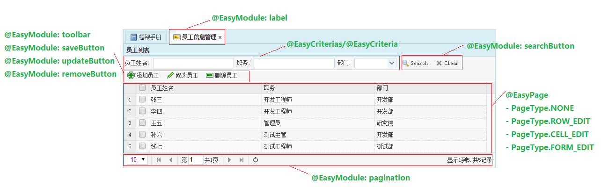
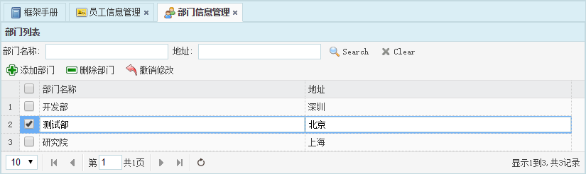
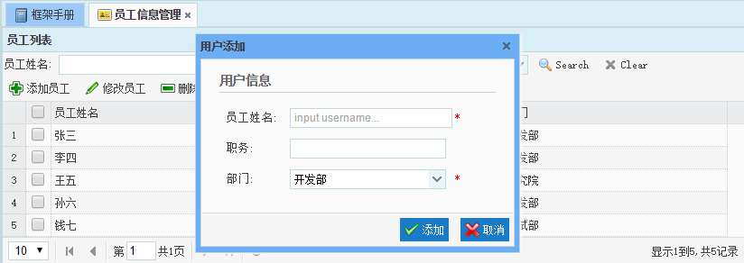
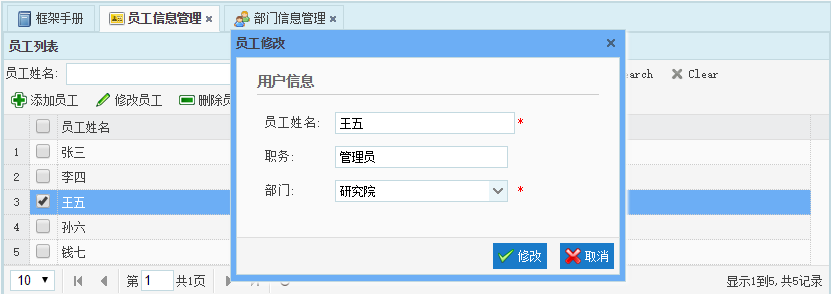

# EasyEE Auto 使用手册

EasyEE Auto 是针对 [EasyEE 开源 JavaEE 企业级快速开发平台](https://github.com/ushelp/EasyEE) 的自动化代码生成器。基于实体规则配置，能够一键快速生成可直接工作的模型，控制器，视图代码。

Least version: `1.2.1-RELEASE` (`EasyEE 4.1.X`)


## 代码生成支持

提供五种类型项目的代码和视图生成。

- **EasyEE-SH-SpringBoot**: `Spring Boot` + `Hibernate(JPA)`

- **EasyEE-SM-SpringBoot**: `Spring Boot` + `MyBatis`

- **EasyEE-SSH**: `Spring` + `Struts2` + `Hibernate(JPA)`

- **EasyEE-SH**: `SpringMVC` + `Hibernate(JPA)`

- **EasyEE-SM**: `SpringMVC` + `MyBatis`

## Maven

```XML
<dependency>
  <groupId>cn.easyproject</groupId>
  <artifactId>easyee-auto</artifactId>
  <version>1.2.1-RELEASE</version>
</dependency>
```

## 使用步骤

### 1. 创建模块包，编写实体

**cn.easyproject.easyee.xxx.`yourmodule`.entity**

EasyEE Auto 生成的模型和控制器代码都会在模块包下(`yourmodule`)，与 `entity` 同级。自动生成结构如下：

`<>`: 自动生成

`[]`: 可选

```
cn.easyproject.easyee.xxx
	yourmodule
		entity
		<controller/action>
		<criteria>
		<service>
		[<dao>]
```


### 2. 注解实体，制定生成规则

编写实体，使用注解标注实体，配置生成规则。

- 类注解：

	```JAVA
	@EasyModule
	@EasyPage
	@EasyAddDialog
	@EasyEditDialog
	@EasyCriterias/@EasyCriteria
	```

- 字段注解: 

	```JAVA
	@EasyId
	@EasyField
	@EasyCriteria
	```

- 示例: 

	```JAVA
	@EasyModule(label="网站基本信息",mybatisTable="web_basic")
	@EasyPage // 页面类型，默认为 PageType.NONE
	public class Basic {
		
		@EasyId // 主键字段，**必须**
		@EasyField(show = false, inputShow=false) // 查询和输入时不显示字段信息
		private int id;
		
		@EasyField(label = "邮箱")
		private String email;
		@EasyField(label = "QQ")
		private String qq;
		@EasyField(label = "电话")
		private String tel;
		@EasyField(label = "公司地址")
		private String address;
		@EasyField(label = "微博地址")
		private String weibo;
		@EasyField(label = "底部版权")
		private String copyright;
		@EasyField(label = "简介")
		private String description;
	
		// setters&getters...	
	}
	```

### 3. 代码生成

选择项目对应代码生成器，进行代码自动化。生成完成会输出权限列表信息。

- 生成器

	`SHSpringBootCodeGenerator.java`: **Spring Boot + Hibernate(JPA)**
	
	`SMSpringBootCodeGenerator.java`: **Spring Boot + MyBatis**
	
	`SHCodeGenerator.java`: **SpringMVC + Hibernate(JPA)**
	
	`SMCodeGenerator.java`: **SpringMVC + MyBatis**
	
	`SSHCodeGenerator.java`: **Spring + Struts2 + Hibernate(JPA)**

- 方法

	```JAVA
	// Generate all the classes under the entity package
	generator(String entityPackage)
	
	// Generates the specified class
	generator(Class... entity)
	```

- 示例

	```JAVA
	public class Code {
		public static void main(String[] args) {
			// EasyEE Auto 
			
			// Generate all the classes under the entity package
			String entityPackage="cn.easyproject.easyee.ssh.cms.entity";
			new SHCodeGenerator().generator(entityPackage);
			
			// Generates the specified class
	//		new SHCodeGenerator().generator(Basic.class);
			
			System.out.println("Generator work done.");
			
		}
	}
	```


### 3. 配置权限

代码生成完成会自动输出需要配置的`菜单权限(#)`和`操作权限(-)`。使用管理员登录系统，按需配置分配权限即可。

- 输出示例

	```
	需要配置的权限列表/Need permission list
	`#` Menu permissions
	`-` Operation permissions
	# Basic/page
		 - Basic/list
		 - Basic/get
		 - Basic/save
		 - Basic/update
		 - Basic/delete
		 - Basic/deleteCascade
	# Menu/page
		 - Menu/list
		 - Menu/get
		 - Menu/save
		 - Menu/update
		 - Menu/delete
		 - Menu/deleteCascade
	# Slider/page
		 - Slider/list
		 - Slider/get
		 - Slider/save
		 - Slider/update
		 - Slider/delete
		 - Slider/deleteCascade
	```


### 4. 运行，按需调整

根据需要，进行自定义调整。


## 页面生成结构



## 注解功能详解

### 类注解：

#### @EasyModule

```JAVA
/**
 * 显示的模块名称，默认为类名
 * @return 生成的显示名
 */
String label() default "";

/**
 * 是否显示分页，默认为true
 * @return 是否
 */
boolean pagination() default true;

/**
 * 是否显示保存，默认为true
 * @return 是否
 */
boolean saveButton() default true;

/**
 * 是否显示修改，默认为true
 * @return 是否
 */
boolean updateButton() default true;

/**
 * 是否显示删除，默认为true
 * @return 是否
 */
boolean removeButton() default true;

/**
 * 是否搜索，默认为true
 * @return 是否
 */
boolean searchButton() default true;

/**
 * 是否显示工具栏，默认为true
 * @return 是否
 */
boolean toolbar() default true;

/**
 * 是否显示右键菜单，默认为true
 * @return 是否
 */
boolean contextMenu() default true;

/**
 * 是否批量删除，默认为true
 * @return 是否
 */
boolean mutipleDelete() default true;

/**
 * MyBatis 表名，默认为类名(MyBatis 专有)
 * @return 表名
 */
String mybatisTable() default "";
```

#### @EasyPage

```JAVA
/**
 * 页面类型，默认为  PageType.NONE
 * @return 
 */
PageType value() default PageType.NONE;
```

##### PageType

```JAVA
public enum PageType {
	/**
	 * 无需直接编辑，默认方式
	 * 自动添加以下类注解
	 * @EasyAddDialog
	 * @EasyEditDialog
	 */
	NONE,
	/**
	 * 行编辑模式
	 */
	ROW_EDIT,
	/**
	 * 列编辑模式
	 */
	CELL_EDIT,
	/**
	 * 表单编辑模式，单行数据
	 */
	FORM_EDIT;
}
```

- `ROW_EDIT` PageType

   
   
- `CELL_EDIT` PageType

   

- `FORM_EDIT` PageType

    


#### @EasyAddDialog

生成添加对话框。

```JAVA
/**
 * User multipart form. (enctype="multipart/form-data")
 * @return
 */
boolean multipart() default false;
```



#### @EasyEditDialog

生成修改对话框。

```JAVA
/**
 * User multipart form. (enctype="multipart/form-data")
 * @return
 */
boolean multipart() default false;
```



#### @Criterias/@Criteria

可以自动生成 Criteria 条件类和页面条件选项。

```JAVA
/**
 * 显示的条件说明，默认为属性名
 * @return 条件属性名
 */
String label() default "";

/**
 * Criteria 条件类属性名，默认为属性名
 * @return 条件属性名
 */
String filed() default "";

/**
 * 查询时，使用的 SQL/HQL 条件名称
 * @return 查询条件名称
 */
String queryConditionName() default "";

/**
 * 查询对象的数据类型
 * @return 数据类型
 */
@SuppressWarnings("rawtypes")
Class type() default Object.class;

/**
 * 进行模糊查询
 * @return 是否模糊查询
 */
boolean like() default false;
```

- 示例

	```JAVA
	// 自定义条件字段
	@EasyCriterias({
		// label 条件显示的名称, filed Criteria 条件类属性名，queryConditionName sql/hql 查询条件名，type
		// 条件属性数据类型，like 是否模糊查询
		@EasyCriteria(label = "部门", filed = "deptno", queryConditionName = "dept.deptno", type = Integer.class) 
	})
	@EasyModule(label="员工")
	@EasyPage
	public class Emp implements java.io.Serializable {
	
		@EasyId // 主键字段，**必须**
		@EasyCriteria(label = "员工编号") // 条件字段信息
		@EasyField(show = false, inputShow=false) // 查询和输入时不显示字段信息
		private Integer empno;
	
		@EasyCriteria(label = "员工姓名", like = true) // 条件字段，模糊查询
		@EasyField(label = "员工姓名", inputRequired = true)
		private String ename;
	
		@EasyCriteria(label = "职务") // 条件字段
		@EasyField(label = "职务")
		private String job;
	
		@EasyField(label = "部门", field = "dept.dname", inputField = "dept.deptno", inputRequired = true)
		private Dept dept;
	
		//....
	}
	```

### 字段注解

#### @EasyId

标注主键字段。必须。

#### @Criteria

标注为条件字段。

#### @EasyField

```JAVA
/**
 * 显示的说明名称，默认为属性名
 * @return 生成的显示名
 */
String label() default "";

/**
 * 是否显示在列表，默认显示
 * @return 是否在数据网格中显示该字段
 */
boolean show() default true;

/**
 * 获取数据的字段名称，默认为属性名
 * @return 生成的显示名
 */
String field() default "";

/**
 * 在添加或编辑时是否显示该字段，默认显示, 仅  DIALOG 编辑模式有效
 * @return 是否在数据网格中显示该字段
 */
boolean inputShow() default true;

/**
 * 添加或编辑时使用的字段名称，默认为属性名, 仅 DIALOG 编辑模式有效
 * @return 输入信息的字段名
 */
String inputField() default "";

/**
 * 添加或编辑时，是否必填，默认为false
 * @return 是否必填
 */
boolean inputRequired() default false;

/**
 * 编辑模式时（Dialog, ROW, CELL, FORM），是否可编辑，默认为true
 * @return 是否必填
 */
boolean updateAble() default true;

/**
 * 编辑模式时，表单元素类型(easyui-textbox, easyui-filebox, easyui-numberbox...)。默认为easyui-textbox。
 * @return 是否必填
 */
String inputClass() default "easyui-textbox";

/**
 * MyBatis 列名，默认为属性名(MyBatis专有)
 * @return 表名
 */
String mybatisColumn() default "";
```


## END

### [官方主页](http://www.easyproject.cn/easyeeauto/zh-cn/index.jsp '官方主页')

[留言评论](http://www.easyproject.cn/easyeeauto/zh-cn/index.jsp#donation '留言评论')

如果您有更好意见，建议或想法，请联系我。

### [The official home page](http://www.easyproject.cn/easyeeauto/en/index.jsp 'The official home page')

[Comments](http://www.easyproject.cn/easyeeauto/en/index.jsp#donation 'Comments')

If you have more comments, suggestions or ideas, please contact me.


Email：<inthinkcolor@gmail.com>

[http://www.easyproject.cn](http://www.easyproject.cn "EasyProject Home")


**支付宝钱包扫一扫捐助：**

我们相信，每个人的点滴贡献，都将是推动产生更多、更好免费开源产品的一大步。

**感谢慷慨捐助，以支持服务器运行和鼓励更多社区成员。**

</img>


We believe that the contribution of each bit by bit, will be driven to produce more and better free and open source products a big step.

**Thank you donation to support the server running and encourage more community members.**

[](https://www.paypal.me/easyproject/10 "Make payments with PayPal - it's fast, free and secure!")


