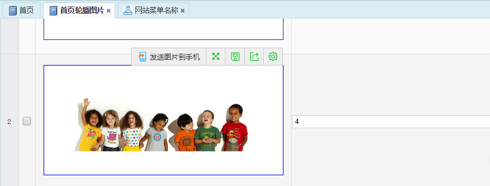
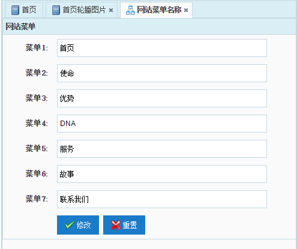

# EasyEE Auto Manual

EasyEE Auto is an automated code generator for the [EasyEE Open Source JavaEE Enterprise Rapid Development Platform] (https://github.com/ushelp/EasyEE). Based on the entity rules configuration, can be a key to quickly generate a direct working model, controller, view code.

Least version: `1.4.0-RELEASE` (`EasyEE 4.4.X+`)


## Code Generator Support

Provides code and view generation for five types of projects.

- **EasyEE-SH-SpringBoot**: `Spring Boot` + `Hibernate(JPA)`

- **EasyEE-SM-SpringBoot**: `Spring Boot` + `MyBatis`

- **EasyEE-SSH**: `Spring` + `Struts2` + `Hibernate(JPA)`

- **EasyEE-SH**: `SpringMVC` + `Hibernate(JPA)`

- **EasyEE-SM**: `SpringMVC` + `MyBatis`


## Maven

```XML
<dependency>
  <groupId>cn.easyproject</groupId>
  <artifactId>easyee-auto</artifactId>
  <version>1.4.0-RELEASE</version>
</dependency>
```

## Steps for usage

### 1. Create a module package and write entities

**cn.easyproject.easyee.xxx.`yourmodule`.entity**

EasyEE Auto generates both the model and the controller code under the module package (`yourmodule`), at the same level as the `entity`. The automatic generation structure is as follows:

`<>`: Automatic generated

`[]`: Optional generated

```
cn.easyproject.easyee.xxx
	yourmodule
		entity
		<controller/action>
		<criteria>
		<service>
		[<dao>]
```


### 2. Annotation entities, specify the generation rules

Write entities, annotate entities, and configure generation rules.

- Class annotation:

	```JAVA
	@EasyModule
	@EasyPage
	@EasyAddDialog
	@EasyEditDialog
	@EasyCriterias/@EasyCriteria
	```

- Field annotation:

	```JAVA
	@EasyId
	@EasyField
	@EasyCriteria
	```

- Example

	```JAVA
	@EasyModule(label="Website info",mybatisTable="web_basic")
	@EasyPage // PageType, default is PageType.NONE
	public class Basic {
		
		@EasyId // Object Id(Primary key), **required**
		@EasyField(show = false, inputShow=false) // Field information is not displayed when querying and entering
		private int id;
		
		@EasyField(label = "Email")
		private String email;
		@EasyField(label = "QQ")
		private String qq;
		@EasyField(label = "Telphone")
		private String tel;
		@EasyField(label = "Company Address")
		private String address;
		@EasyField(label = "Weibo")
		private String weibo;
		@EasyField(label = "Copyright")
		private String copyright;
		@EasyField(label = "Description")
		private String description;
	
		// setters&getters...	
	}
	```

### 3. Code generation

Select the project code generator for code automation. Generating complete outputs the permission list information.

- Generator

	`SHSpringBootCodeGenerator.java`: **Spring Boot + Hibernate(JPA)**
	
	`SMSpringBootCodeGenerator.java`: **Spring Boot + MyBatis**
	
	`SHCodeGenerator.java`: **SpringMVC + Hibernate(JPA)**
	
	`SMCodeGenerator.java`: **SpringMVC + MyBatis**
	
	`SSHCodeGenerator.java`: **Spring + Struts2 + Hibernate(JPA)**

- Method

	```JAVA
	// Generate all the classes under the entity package
	generator(String entityPackage)
	// Choice modules to generate
	generator(EasyAutoModule[] modules, String entityPackage)
	
	// Generates the specified class
	generator(Class... entity)
	// Choice modules to generate
	generator(EasyAutoModule[] modules, Class... entity)
	```

- Example

	```JAVA
	public class Code {
		public static void main(String[] args) {
			// EasyEE Auto 
			
			// Generate all the classes under the entity package
			String entityPackage="cn.easyproject.easyee.ssh.cms.entity";
			new SHCodeGenerator().generator(entityPackage);
			
			// Generates the specified class
	//		new SHCodeGenerator().generator(Basic.class);
			
			System.out.println("Generator work done.");
			
		}
	}
	```

- Generating Module Selection:
	
	You can specify the modules that are generated by enumerating the arrays.
	
	```JAVA
	// Generator all modules, you can choice
	new SMCodeGenerator().generator(new EasyAutoModule[]{
				EasyAutoModule.CONTROLLER_CLASS, // Controller/Action 控制器类
				EasyAutoModule.CRITERIA_CLASS, // Criteria
				EasyAutoModule.MYBATIS_DAO_INTERFACE, // MyBatis DAO interface
				EasyAutoModule.MYBATIS_MAPPER_XML, // MyBatis mapper.xml
				EasyAutoModule.PAGE, // View page
				EasyAutoModule.SERVICE_INTERFACE, // Service interface
				EasyAutoModule.SERVICE_IMPLEMENTS // Server implements
		},entityPackage);
	```


### 3. Configure permissions

Code generation completes automatically by outputting `menu permissions (#)` and `operation rights (-)` which need to be configured. Use the administrator login system, on-demand configuration can be assigned permissions.


- Output Example

	```
	需要配置的权限列表/Need permission list
	`#` Menu permissions
	`-` Operation permissions
	# Basic/page
		 - Basic/list
		 - Basic/get
		 - Basic/save
		 - Basic/update
		 - Basic/delete
		 - Basic/deleteCascade
	# Menu/page
		 - Menu/list
		 - Menu/get
		 - Menu/save
		 - Menu/update
		 - Menu/delete
		 - Menu/deleteCascade
	# Slider/page
		 - Slider/list
		 - Slider/get
		 - Slider/save
		 - Slider/update
		 - Slider/delete
		 - Slider/deleteCascade
	```


### 4. Running, on-demand adjustment

Make custom adjustments as needed.


## Page generation structure


## Annotation function

### Class annotation:

#### @EasyModule

```JAVA
/**
 * 显示的模块名称，默认为类名
 * @return 生成的显示名
 */
String label() default "";

/**
 * 模块名称 I18N 国际化键，优先级低于label()
 * @return 国际化键名
 */
String labelKey() default "";

/**
 * 是否显示分页，默认为true
 * @return 是否
 */
boolean pagination() default true;

/**
 * 是否显示保存，默认为true
 * @return 是否
 */
boolean saveButton() default true;

/**
 * 是否显示修改，默认为true
 * @return 是否
 */
boolean updateButton() default true;

/**
 * 是否显示删除，默认为true
 * @return 是否
 */
boolean removeButton() default true;

/**
 * 是否搜索，默认为true
 * @return 是否
 */
boolean searchButton() default true;

/**
 * 是否显示工具栏，默认为true
 * @return 是否
 */
boolean toolbar() default true;

/**
 * 是否显示右键菜单，默认为true
 * @return 是否
 */
boolean contextMenu() default true;

/**
 * 是否批量删除，默认为true
 * @return 是否
 */
boolean mutipleDelete() default true;

/**
 * MyBatis 表名，默认为类名(MyBatis 专有)
 * @return 表名
 */
String mybatisTable() default "";
```

#### @EasyPage

```JAVA
/**
 * 页面类型，默认为  PageType.NONE
 * @return 
 */
PageType value() default PageType.NONE;
```

##### PageType

```JAVA
public enum PageType {
	/**
	 * 无需直接编辑，默认方式
	 * 自动添加以下类注解
	 * @EasyAddDialog
	 * @EasyEditDialog
	 */
	NONE,
	/**
	 * 行编辑模式
	 */
	ROW_EDIT,
	/**
	 * 列编辑模式
	 */
	CELL_EDIT,
	/**
	 * 表单编辑模式，单行数据
	 */
	FORM_EDIT;
}
```

- `ROW_EDIT` PageType

   
   
- `CELL_EDIT` PageType

   

- `FORM_EDIT` PageType

    


#### @EasyAddDialog

The Add dialog is generated.

```JAVA
/**
 * User multipart form. (enctype="multipart/form-data")
 * @return
 */
boolean multipart() default false;
```


#### @EasyEditDialog

The Modify dialog is generated.

```JAVA
/**
 * User multipart form. (enctype="multipart/form-data")
 * @return
 */
boolean multipart() default false;
```


#### @Criterias/@Criteria

Criteria condition classes and page condition options can be generated automatically.

```JAVA
/**
 * 显示的条件说明，默认为属性名
 * @return 条件属性名
 */
String label() default "";

/**
 * 条件说明 I18N 国际化键，优先级低于label()
 * @return 国际化键名
 */
String labelKey() default "";

/**
 * Criteria 条件类属性名，默认为属性名
 * @return 条件属性名
 */
String filed() default "";

/**
 * 查询时，使用的 SQL/HQL 条件名称
 * @return 查询条件名称
 */
String queryConditionName() default "";

/**
 * 查询对象的数据类型
 * @return 数据类型
 */
@SuppressWarnings("rawtypes")
Class type() default Object.class;

/**
 * 进行模糊查询
 * @return 是否模糊查询
 */
boolean like() default false;
```

- Example

	```JAVA
	// 自定义条件字段
	@EasyCriterias({
		// label 条件显示的名称, filed Criteria 条件类属性名，queryConditionName sql/hql 查询条件名，type
		// 条件属性数据类型，like 是否模糊查询
		@EasyCriteria(label = "部门", filed = "deptno", queryConditionName = "dept.deptno", type = Integer.class) 
	})
	@EasyModule(label="员工")
	@EasyPage
	public class Emp implements java.io.Serializable {
	
		@EasyId // 主键字段，**必须**
		@EasyCriteria(label = "员工编号") // 条件字段信息
		@EasyField(show = false, inputShow=false) // 查询和输入时不显示字段信息
		private Integer empno;
	
		@EasyCriteria(label = "员工姓名", like = true) // 条件字段，模糊查询
		@EasyField(label = "员工姓名", inputRequired = true)
		private String ename;
	
		@EasyCriteria(label = "职务") // 条件字段
		@EasyField(label = "职务")
		private String job;
	
		@EasyField(label = "部门", field = "dept.dname", inputField = "dept.deptno", inputRequired = true)
		private Dept dept;
	
		//....
	}
	```

### 字段注解

#### @EasyId

The primary key field. required.

#### @Criteria

A condition field.

#### @EasyField

```JAVA
/**
 * 显示的说明名称，默认为属性名
 * @return 生成的显示名
 */
String label() default "";

/**
 * 名称 I18N 国际化键，优先级低于label()
 * @return 国际化键名
 */
String labelKey() default "";

/**
 * 是否显示在列表，默认显示
 * @return 是否在数据网格中显示该字段
 */
boolean show() default true;

/**
 * 获取数据的字段名称，默认为属性名
 * @return 生成的显示名
 */
String field() default "";

/**
 * 在添加或编辑时是否显示该字段，默认显示, 仅  DIALOG 编辑模式有效
 * @return 是否在数据网格中显示该字段
 */
boolean inputShow() default true;

/**
 * 添加或编辑时使用的字段名称，默认为属性名, 仅 DIALOG 编辑模式有效
 * @return 输入信息的字段名
 */
String inputField() default "";

/**
 * 添加或编辑时，是否必填，默认为false
 * @return 是否必填
 */
boolean inputRequired() default false;

/**
 * 编辑模式时（Dialog, ROW, CELL, FORM），是否可编辑，默认为true
 * @return 是否必填
 */
boolean updateAble() default true;

/**
 * 编辑模式时，表单元素类型(easyui-textbox, easyui-filebox, easyui-numberbox...)。默认为easyui-textbox。
 * @return 是否必填
 */
String inputClass() default "easyui-textbox";

/**
 * MyBatis 列名，默认为属性名(MyBatis专有)
 * @return 表名
 */
String mybatisColumn() default "";
```

## I18N 国际化支持

`@EasyModule`, `@EasyCriteria`, `@EasyField` can use `labelKey` instead of `label`, set i18n key.

```JAVA
@EasyField(
//			label = "邮箱", 
			labelKey="basic.mail")
private String email;
```


## END
### [The official home page](http://www.easyproject.cn/easyeeauto/en/index.jsp 'The official home page')

[Comments](http://www.easyproject.cn/easyeeauto/en/index.jsp#donation 'Comments')

If you have more comments, suggestions or ideas, please contact me.


### [官方主页](http://www.easyproject.cn/easyeeauto/zh-cn/index.jsp '官方主页')

[留言评论](http://www.easyproject.cn/easyeeauto/zh-cn/index.jsp#donation '留言评论')

如果您有更好意见，建议或想法，请联系我。


Email：<inthinkcolor@gmail.com>

[http://www.easyproject.cn](http://www.easyproject.cn "EasyProject Home")


We believe that the contribution of each bit by bit, will be driven to produce more and better free and open source products a big step.

**Thank you donation to support the server running and encourage more community members.**

[](https://www.paypal.me/easyproject/10 "Make payments with PayPal - it's fast, free and secure!")
